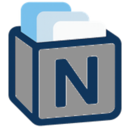

<p align="center">
  
</p>

# nTabs Chrome Extension

A Chrome extension to manage, organize, and sync your open Chrome tabs to Notion collections.

## Features

- View all open tabs in a sortable table
- Select, close, or open multiple tabs at once
- Save and label collections of tabs
- Sync selected tabs to a Notion database (with collection and created date)
- Chrome sync for collections across devices
- Modern and intuitive UI

## Notion Sync

- Enter your Notion API key and database ID in the extension's settings
- Sync selected tabs to your Notion database with one click
- Each synced tab includes: title, URL, collection name, and created date
- Requires a Notion integration with access to your database

## Installation

1. Clone this repository:
   ```bash
git clone https://github.com/dbbaskette/nTabs.git
```
2. Open Chrome and go to `chrome://extensions/`
3. Enable "Developer mode" in the top right corner
4. Click "Load unpacked" and select the cloned `nTabs` directory

## Usage

1. Click the nTabs extension icon in your Chrome toolbar
2. Enter your Notion API key and database ID in Settings, then save
3. Use the main popup to:
   - Refresh and view all open tabs
   - Select tabs using checkboxes
   - Add selected tabs to a named collection
   - Sync selected tabs to Notion
   - Close or open selected tabs
4. Collections are synced across your Chrome browsers (if signed in)

## Notion Database Schema

Your Notion database should have the following properties:
- **Name** (title)
- **URL** (url)
- **Collection** (rich_text)
- **Created Date** (date)

## Security
- Your Notion API key is stored only in Chrome's extension storage.
- The extension does not log or expose your API key or tab data.
- Collection names are validated for safe input.

## Development

Built with:
- HTML5
- CSS3
- JavaScript (ES6)
- Chrome Extension API

## Contributing

Contributions are welcome! Please open an issue or submit a pull request.

## License

MIT License. See LICENSE file for details.

## Logo

A simple logo is provided in the `icons/` directory.


If you would like a new logo, please specify your preferred style or color scheme!